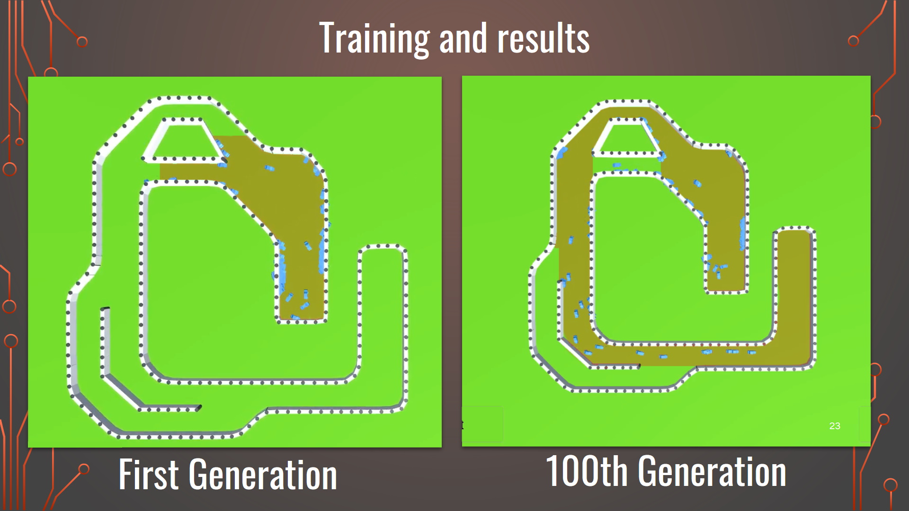
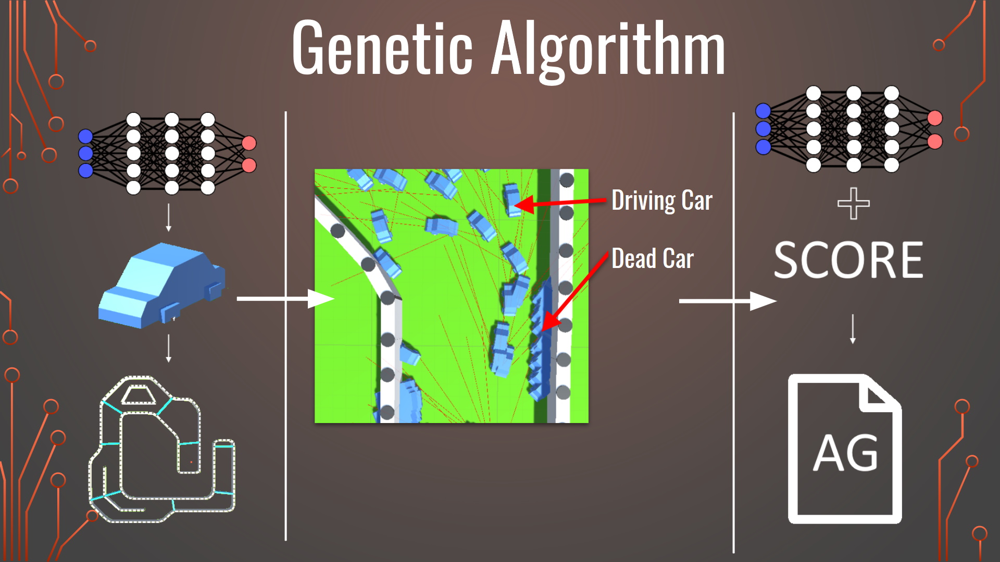

### Hi! I'm Lucas Braz, a fifth year engineering student (MSc) at CPE Lyon with one year of Master exchange at EPFL.
Currently **Deep Learning Research Engineer Intern** at **CNRS** (**CREATIS laboratory**).   
**I study Computer science, signal and image processing and machine learning.**  

**I'm Looking for a 6 months internship starting in March 2023 as a end of studies project.**   
*Willing to relocate in Europe, Switzerland, US or Canada*.  

I'm deeply passionated by Artificial Intelligence and it's transversal applications especially for multi-agent simulations and computer vision tasks.   
I enjoy maths, algorithmic problems and simulation modeling.   
More generally, I am interested in consciousness and moral analytic philosophical questions, epistemology and sciences.    

**I intend to work as a Deep Learning Research Engineer.**   
*Or Deep Learning Research Scientist if I apply for a PhD.*  

#### Here are some projects that I have done:
- [ML_EPFL_Project_2](https://www.github.com/LucasBrazCappelo/ML_EPFL_Project_2)

A Convolutional Neural Network with **Pytorch** to perform semantic segmentation of roads on satellite images.  
My first Pytorch project, after some personal classification projects using numpy where I implemented all BackProp computations by matrix calculation with Numpy.   
We obtained good results by implementing a variation of the famous **U-Net**, very efficient for semantic classification.   
*Click on the link above for more details.*    
   
- A second year AI project about Autonomous Vehicules

Using Unity for simulation, we trained cars (a little Fully-Connected Neural Network. The distance of the cars to the walls according to several angles in input, the direction and the speed in output) to complete a circuit.  
We launched 100 independent cars (and their network) by round and we calculated their score according to the distance covered on the course and their time.
We used a simple genetic algorithm for optimization phase.  
The results were very satisfactory, with a good convergence, we quickly reached the end of the circuit. By saving the best network and reintroducing it in a new circuit, it obtained good results too, thus letting appear a good generalization.   
 
- A personal project of video game on Super Nintendo coded directly in assembly.  

I was very enthusiastic to realize this project as soon as I had some basic knowledge in assembler, thus realizing one of my oldest dream and allowing me to understand at the lowest level how my favorite game console works.  
It was necessary to understand from scratch the machine language (65C816) and the functioning of the exchanges between CPU, different memories and graphics chip, challenging but very exciting. Big thanks to the people who still make documentation available on the internet.  
   

- [Maze Solver](https://github.com/Maxlo24/Project_CPP_4ETI)

A C++ and Qt project of Maze generation and solving with different exploration algorithms implemented.   
*Click on the link above for more details.*   
                                  
   
   
**But also, in bulk (not exhaustive)**:
- a **Deep Reinforcement Learning project** accessible [here](https://www.github.com/LucasBrazCappelo/ReinforcementLearningProject).
- Simulations of physical phenomena by PDE and ODE
- a small project of 3D game on GPU with OpenGL in C++
- Computer Vision or Image Processing task as image denoising, image compression...
- a multithreaded Game of Life of Conway project in Python (Tk)
- a project of Data Analysis accessible [here](https://kallebju.github.io/ada-website/)
- a front-end website accessible [here](https://github.com/MathieuLeclercq/site-de-voyage)
- a Space Invaders Game in Python (Tk) accesible [here](https://github.com/MathieuLeclercq/Space-Invaders-)
- a Multimodal Robust Route Planner for the Zürich area: Data Science project on large databases with **PySpark**.
- a **movie recommender system** project in Scala and **Spark** accessible [here](https://www.github.com/LucasBrazCappelo/MovieRecommenderSystem)
